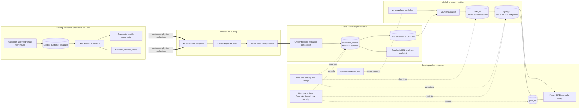

# Architecture

## Design summary

Snowflake managed tables are continuously mirrored into OneLake. That mirrored database is the source-aligned Bronze layer. Fabric Spark notebooks materialize the first transformation copy in Silver, then build a Gold star schema and customer-risk aggregate for Direct Lake and Warehouse consumption.

Double blue lines represent physical replication. Solid green paths represent transformations/materialization. Dotted paths are control-plane governance and source control, not data movement.

## Why the mirror is Bronze

Fabric Mirroring already maintains the source-shaped Delta representation in OneLake. Creating an additional copy named `bronze_lh` would add latency, storage, and another failure surface without improving immutability or schema control. `silver_lh` is the first additional copy because it performs meaningful work:

- normalizes Snowflake uppercase source names into an analytical naming contract;
- makes data types explicit and timestamps consistent;
- deduplicates by business key and latest source timestamp;
- validates risk ranges and source relationships;
- quarantines invalid records with a reason;
- adds `source_system`, pipeline-run, run-date, and load-time lineage.

## Source-to-serving lineage

| Snowflake object | Silver | Gold/serving |
|---|---|---|
| `TRANSACTIONS` | `transactions`, `quarantine_transactions` | `FactTransactions`, `DimAccount`, `DimCustomer`, `DimDate`, risk profile |
| `TRANSACTION_RISK` | `transaction_risk`, `quarantine_transaction_risk` | `FactTransactions`, risk profile |
| `MERCHANTS` | `merchants`, `quarantine_merchants` | `DimMerchant` |
| `DIGITAL_SESSIONS` | `sessions`, `quarantine_sessions` | `FactDigitalSessions`, risk profile |
| `DEVICES` | `devices`, `quarantine_devices` | `DimDevice`, risk profile |
| `FRAUD_ALERTS` | `fraud_alerts`, `quarantine_fraud_alerts` | `FactFraudAlerts`, risk profile and investigation drill-through |

## Pipeline behavior

`pl_snowflake_medallion` records pipeline start, validates the six Snowflake mirror tables, builds Silver, builds Gold, publishes the Warehouse contract, reconciles counts/relationships, and records success. Every material stage has a failure dependency that writes the failed stage and available error message.

Silver and Gold use deterministic full-refresh writes for the bounded POC dataset. Audit, source-validation, and reconciliation tables merge on stable pipeline keys, so retrying the same `pipeline_run_id` is idempotent. Snowflake loading uses staging tables and `MERGE ... ALL BY NAME` keyed by source business IDs.

## Analytical model

The Gold model reuses the reference POC's transparent fraud heuristic. `AggCustomerRiskProfile` combines a 30-day transaction window with average/high-risk transaction scores, alert count, failed logins, untrusted devices, and non-US session observations. The score is capped at 100 and banded Low/Medium/High. It is a deterministic demo calculation, not a production fraud model.

The suspicious-transaction drill-through combines a high-risk transaction, device trust, recent digital behavior, and a linked fraud alert. Although all records now originate in Snowflake, they represent separate operational domains and still demonstrate conformance across heterogeneous table shapes.

## Security boundaries

1. Snowflake roles constrain loader and mirror access to the approved existing warehouse, dedicated POC schema, and six tables. Setup and cleanup never create or drop the customer database or warehouse.
2. The Fabric connection owns its credential; the repository stores only a connection identifier placeholder.
3. Snowflake row-access, masking, and column policies do not propagate. Fabric workspace/item permissions, OneLake security, semantic-model security, and Warehouse RLS/DDM are configured independently.
4. Git contains source code and placeholders only. `.env`, keys, data, logs, caches, IDs, and live evidence are ignored or sanitized.

## Network and region boundary

The customer deployment defaults to Snowflake Azure Private Link through a Fabric VNet data gateway. It uses a dedicated delegated gateway subnet, a separate private-endpoint subnet, and customer-managed private DNS for the account and OCSP hostnames. Direct cloud connectivity is an explicit lab exception. The Snowflake Azure region and Fabric capacity region should match when practical to reduce latency and egress charges.

## Deployment boundary

Local tests prove generators, validators, definitions, pipeline binding, notebook syntax/contracts, governance helpers, and secret controls. The sanitized reference run proves the data and Fabric path over direct cloud connectivity. PrivateLink authorization, private DNS, VNet gateway routing, and policy enforcement must be validated in each customer environment using `docs/validation.md`.
